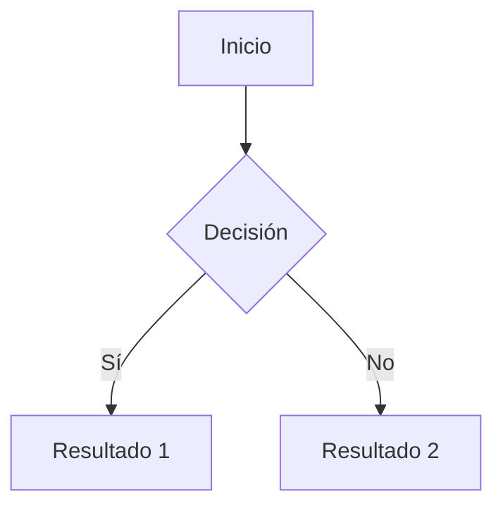

# Guía de Recursos para Crear Material de Estudio en Markdown

## Estructura Base de Documentos

```markdown
---
title: 'Título del Documento'
date: '2024-12-05'
author: 'Nombre del Autor'
tags: ['tag1', 'tag2']
---

# Título Principal del Documento

## Descripción General

[Breve descripción del contenido]

## Objetivos de Aprendizaje

- Objetivo 1
- Objetivo 2
- Objetivo 3
```

## Elementos Básicos de Formato

### Títulos

```markdown
# Título 1

## Título 2

### Título 3

#### Título 4

##### Título 5

###### Título 6
```

### Énfasis de Texto

```markdown
_texto en cursiva_
**texto en negrita**
**_texto en negrita y cursiva_**
`código en línea`
~~texto tachado~~
```

### Listas

```markdown
- Lista sin orden
- Segundo elemento
  - Sub-elemento
  - Sub-elemento 2

1. Lista ordenada
2. Segundo elemento
   1. Sub-elemento
   2. Sub-elemento 2
```

## Elementos Avanzados

### Bloques de Código

````markdown
```python
def ejemplo():
    print("Código de ejemplo")
```

```javascript
function ejemplo() {
  console.log('Ejemplo en JavaScript');
}
```
````

### Tablas

```markdown
| Concepto | Descripción | Ejemplo |
| -------- | ----------- | ------- |
| Item 1   | Desc 1      | Ej. 1   |
| Item 2   | Desc 2      | Ej. 2   |
```

### Notas y Advertencias

```markdown
> **Nota:** Información importante que los estudiantes deben tener en cuenta.

> **⚠️ Advertencia:** Puntos críticos o errores comunes a evitar.

> **💡 Tip:** Consejos útiles para mejorar el aprendizaje.
```

## Recursos Multimedia

### Enlaces

```markdown
[Texto del enlace](URL 'Título opcional')
[Referencia a documento interno](./ruta/al/documento.md)
```

### Imágenes

```markdown

```

### Diagramas con Mermaid

````markdown

````

## Componentes Especiales para Estudio

### Ejercicios y Problemas

```markdown
### 📝 Ejercicio 1

**Objetivo:** [Descripción del objetivo]

**Instrucciones:**

1. Paso 1
2. Paso 2
3. Paso 3

**Pista:** [Opcional]

<details>
<summary>Ver solución</summary>

[Solución detallada aquí]

</details>
```

### Resumen de Conceptos

```markdown
### 📚 Resumen

---

#### Conceptos Clave

- Concepto 1: Definición
- Concepto 2: Definición
- Concepto 3: Definición

#### Fórmulas Importantes

- Fórmula 1: `ecuación`
- Fórmula 2: `ecuación`
```

### Referencias Bibliográficas

```markdown
## 📚 Referencias

1. [Título del recurso](URL) - Breve descripción
2. [Título del libro](URL) - Autor, Año
```
