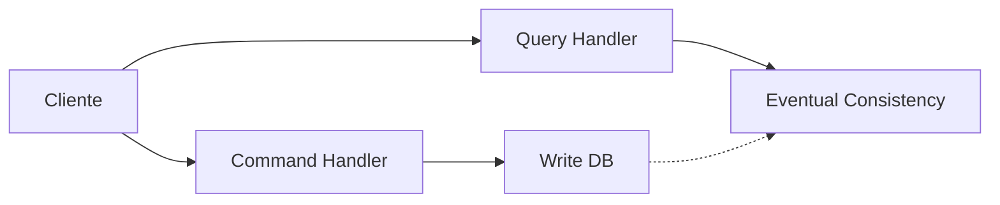

# Escalabilidad en Sistemas Distribuidos

## Introducción a la Escalabilidad

### Definición

La escalabilidad es la capacidad de un sistema para agregar recursos a medida que la demanda aumenta sin comprometer su rendimiento. El principal desafío radica en hacer este proceso eficiente mediante estrategias efectivas en términos de costo.

### Objetivos de Aprendizaje

- Comprender los diferentes tipos de escalabilidad en sistemas distribuidos
- Analizar las estrategias de escalamiento horizontal y vertical
- Entender el teorema CAP y sus implicaciones
- Explorar patrones como CQRS y Event Sourcing

## Escalabilidad de Servidores

### Tipos de Escalabilidad

| Característica | Escalabilidad Horizontal     | Escalabilidad Vertical                  |
| -------------- | ---------------------------- | --------------------------------------- |
| Implementación | Añade más servidores         | Aumenta recursos del servidor existente |
| Resiliencia    | Alta (distribución de carga) | Baja (punto único de falla)             |
| Comunicación   | A través de red              | Entre procesos                          |
| Consistencia   | Eventual                     | Fuerte                                  |
| Costo          | Lineal                       | Exponencial                             |

### Balanceo de Carga

#### Estrategias de Distribución

1. **Sticky Session**
   - Mismo usuario - mismo servidor
   - Utiliza cookies para identificación
2. **Round-robin**
   - Distribución secuencial entre servidores
   - A → B → C → D → A
3. **Por carga**
   - Asignación según capacidad disponible
4. **Aleatorio**
   - Distribución probabilística

## Escalabilidad de Datos

### Técnicas de Particionamiento

#### Sharding

- **Por llaves**: Utiliza función hash para distribución
- **Por rangos**: Divide datos según valores específicos
- **Por listas**: Asigna datos según categorías predefinidas
- **Por ciclo de vida**: Distribuye según antigüedad o estado

#### CQRS (Command Query Responsibility Segregation)

## Teorema CAP

### Principios Fundamentales

- **Consistencia**: Todos los nodos tienen la misma información
- **Disponibilidad**: El sistema responde siempre
- **Tolerancia a particiones**: Funciona pese a fallos de red

### Combinaciones Posibles

| Combinación | Características              | Ejemplos            |
| ----------- | ---------------------------- | ------------------- |
| CA          | Sin tolerancia a particiones | MySQL, PostgreSQL   |
| CP          | Prioriza consistencia        | MongoDB, Redis      |
| AP          | Prioriza disponibilidad      | Cassandra, DynamoDB |

## PACELC

Extensión del teorema CAP que considera:

- **Partición**: Comportamiento durante fallos
- **Latencia vs Consistencia**: Comportamiento normal

## Recursos Adicionales

### Herramientas y Tecnologías

- AWS Elastic Load Balancer
- Azure Traffic Manager
- MongoDB Atlas
- Apache Cassandra
- Redis Cluster

### Referencias Académicas

1. "Principles of Distributed Database Systems" - M. Tamer Özsu
2. "Designing Data-Intensive Applications" - Martin Kleppmann
3. "Building Microservices" - Sam Newman

### Enlaces Útiles

- [AWS Documentation - Scalability](https://docs.aws.amazon.com/whitepapers/latest/introduction-devops-aws/scalability.html)
- [Microsoft Learn - Distributed Systems](https://learn.microsoft.com/en-us/azure/architecture/guide/architecture-styles/web-queue-worker)
- [MongoDB University - Sharding](https://university.mongodb.com/courses/M103/about)
