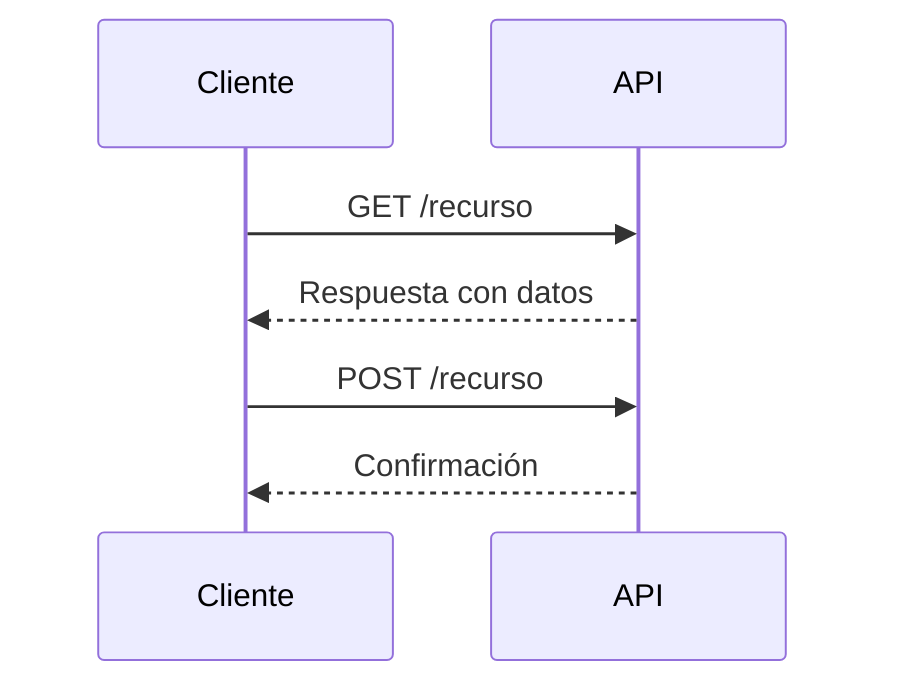

# Integración de Sistemas y Servicios Web

## Descripción General

Este documento cubre los conceptos fundamentales de la integración de sistemas y servicios web, enfocándose en los desafíos, soluciones y metodologías modernas de implementación.

## Objetivos de Aprendizaje

- Comprender los principales desafíos en la integración de sistemas
- Identificar y aplicar diferentes estrategias de integración
- Dominar los conceptos fundamentales de servicios web y REST
- Implementar soluciones prácticas usando APIs modernas

## Desafíos en la Integración de Sistemas

### Retos Principales

1. **Heterogeneidad de Sistemas**

   - Todos los sistemas son diferentes
   - Variedad de tecnologías y plataformas
   - Diversos formatos de datos

2. **Gestión del Cambio**

   - El cambio es inevitable
   - Necesidad de adaptación continua
   - Impacto en sistemas integrados

3. **Infraestructura de Red**
   - Redes poco confiables
   - Latencia y velocidad variable
   - Necesidad de estrategias de resiliencia

## Estrategias de Integración

### Formas de Integración

| Estrategia                | Descripción                               | Consideraciones                                          |
| ------------------------- | ----------------------------------------- | -------------------------------------------------------- |
| Transferencia de Archivos | Intercambio de datos mediante archivos    | Requiere coordinación en nombres, ubicaciones y formatos |
| Base de Datos Compartida  | Múltiples sistemas acceden a una BD común | Puede convertirse en punto único de falla                |
| Mensajería                | Comunicación mediante canales definidos   | Necesita acuerdos en formatos y protocolos               |

### Soluciones al Problema de Integración

1. **Suite Integrada**

   - Sistema único con todas las funcionalidades
   - Elimina problemas de integración
   - Menor flexibilidad

2. **Integración de Sistemas Existentes**
   - Mantiene sistemas actuales
   - Permite interoperabilidad
   - Mayor complejidad de implementación

## Servicios Web

### Definición y Características

> **Definición:** Un servicio es un conjunto de funciones de software relacionadas entre sí que pueden ser reutilizadas para diferentes propósitos.

#### Características Principales

- Acceso mediante interfaz establecida
- Reglas de acceso y uso definidas
- Independencia del lenguaje de implementación
- Transporte sobre HTTP

### REST (Representational State Transfer)

#### Principios Fundamentales

1. **Arquitectura Cliente-Servidor**
2. **Sistema por Capas**
3. **Caché**
4. **Servidor Stateless**
5. **Interfaz Uniforme**
   - Identificación de recursos
   - Manipulación mediante representaciones
   - Mensajes autodescriptivos

## Ejercicios Prácticos

### Análisis de APIs

### Ejemplo: GitHub API

El documento incluye un ejercicio práctico utilizando la API de GitHub que demuestra:

- Gestión de organizaciones
- Creación de repositorios
- Administración de permisos
- Integración con servicios (Copilot)

## Referencias y Recursos Adicionales

1. [RESTful Web APIs](https://www.oreilly.com/library/view/restful-web-apis/9781449359713/) - Richardson & Amundsen
2. [API Documentation Best Practices](https://swagger.io/resources/articles/best-practices-in-api-documentation/)
3. [GitHub REST API Documentation](https://docs.github.com/es/rest)

### Herramientas Recomendadas

- Postman para pruebas de API
- Swagger para documentación
- Git para control de versiones
- GitHub para gestión de repositorios

## Notas Importantes

> **💡 Tip:** Al diseñar servicios web, siempre considerar la escalabilidad y mantenibilidad desde el inicio.

> **⚠️ Advertencia:** La integración de sistemas requiere una planificación cuidadosa y consideración de todos los casos de uso posibles.
