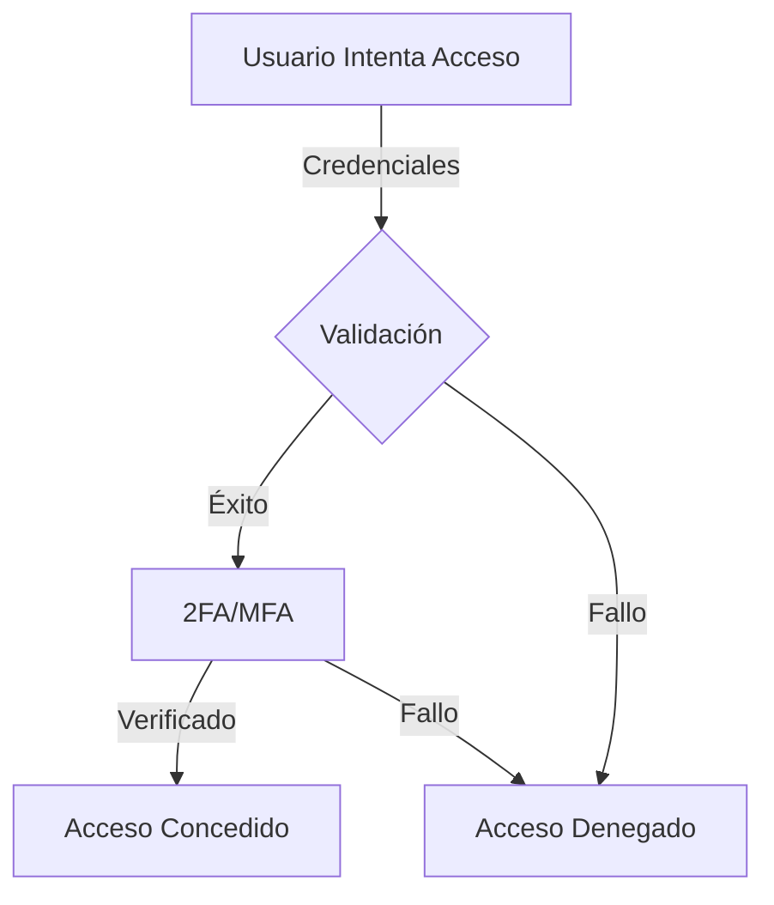
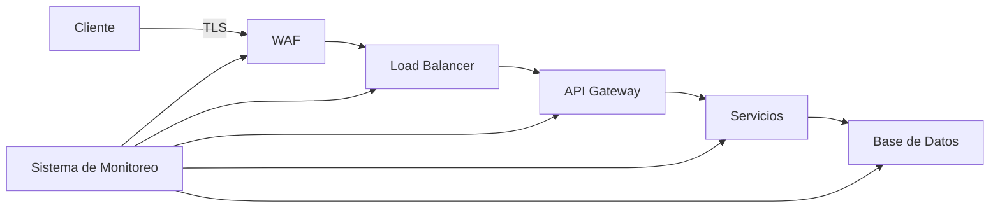

# Análisis de Seguridad en Sistemas Financieros: Caso BancoEstado 2024

## Descripción General

Este documento analiza el caso de fraude bancario descubierto en BancoEstado en 2024, utilizándolo como caso de estudio para comprender los aspectos críticos de la seguridad en sistemas financieros y las medidas de prevención necesarias.

## Objetivos de Aprendizaje

- Comprender las vulnerabilidades comunes en sistemas financieros
- Analizar métodos de detección y prevención de fraudes bancarios
- Identificar mejores prácticas de seguridad en transacciones financieras
- Evaluar la importancia de los sistemas de monitoreo y auditoría

## Análisis del Caso

### Contexto del Fraude

- **Monto Involucrado**: $6.100 millones CLP
- **Tipo de Delito**: Asociación ilícita y lavado de dinero
- **Institución Afectada**: BancoEstado (banco estatal chileno)

### Aspectos Técnicos del Fraude

#### Vectores de Ataque Comunes en Sistemas Bancarios

| Vector de Ataque  | Descripción                                         | Medidas de Prevención                      |
| ----------------- | --------------------------------------------------- | ------------------------------------------ |
| Phishing          | Suplantación de identidad para obtener credenciales | Autenticación multifactor                  |
| SQL Injection     | Manipulación de consultas a base de datos           | Validación de inputs y prepared statements |
| Man-in-the-Middle | Interceptación de comunicaciones                    | Encriptación end-to-end                    |
| Insider Threats   | Amenazas internas por empleados                     | Sistemas de monitoreo y logging            |

### Mejores Prácticas de Seguridad

#### 1. Autenticación y Autorización

#### 2. Monitoreo y Detección

- **Sistemas de Detección de Fraude**
  - Análisis de patrones de comportamiento
  - Machine Learning para detección de anomalías
  - Monitoreo en tiempo real de transacciones

#### 3. Respuesta a Incidentes

1. Detección temprana
2. Contención del incidente
3. Investigación forense
4. Recuperación y mitigación
5. Lecciones aprendidas

### Recomendaciones Técnicas

#### Arquitectura de Seguridad

#### Controles de Seguridad Esenciales

1. **Prevención**

   - Encriptación de datos en reposo y tránsito
   - Segmentación de red
   - Principio de mínimo privilegio

2. **Detección**

   - IDS/IPS
   - SIEM
   - Análisis de comportamiento

3. **Respuesta**
   - Plan de respuesta a incidentes
   - Equipo de respuesta (CSIRT)
   - Procedimientos de recuperación

## Lecciones Aprendidas

### Puntos Críticos

> **⚠️ Advertencia:** Los sistemas financieros requieren múltiples capas de seguridad y no deben confiar en un único mecanismo de protección.

### Mejores Prácticas

> **💡 Tip:** Implementar un enfoque de "Zero Trust" donde cada transacción es verificada independientemente de su origen.

## Referencias

1. NIST Special Publication 800-53 - Security Controls for Information Systems
2. PCI DSS v4.0 - Payment Card Industry Data Security Standard
3. ISO 27001 - Information Security Management Systems

### Recursos Adicionales

- [OWASP Top 10 Financial Application Risks](https://owasp.org/)
- [NIST Cybersecurity Framework](https://www.nist.gov/cyberframework)
- [Financial Services Information Sharing and Analysis Center (FS-ISAC)](https://www.fsisac.com/)
