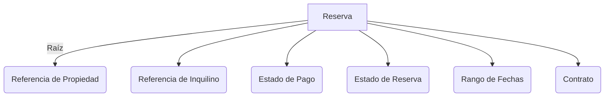
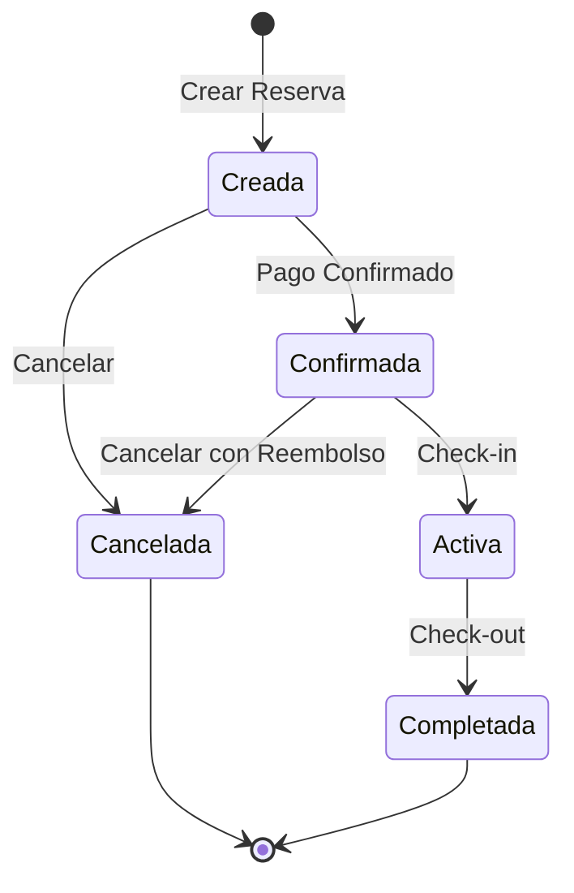

# Análisis de Diseño Guiado por el Dominio: Plataforma de Alquiler de Propiedades

## 📚 Introducción

Este documento analiza una plataforma de alquiler de propiedades utilizando principios de Diseño Guiado por el Dominio (DDD). La plataforma permite a los propietarios listar propiedades, a los inquilinos hacer reservas, y a ambas partes gestionar pagos y contratos.

## 🎯 Análisis de Conceptos Clave

### Identificación del Dominio

#### Dominio Principal

- **Gestión de Alquiler de Propiedades**
  - Experto: Product Owner / Gerente de Operaciones Inmobiliarias
  - Usuarios: Propietarios, Inquilinos, Administradores de Propiedades
  - Enfoque: Reglas y flujos de trabajo del negocio principal para alquileres de propiedades

#### Subdominios

1. **Gestión de Propiedades**

   - Experto: Gerente de Operaciones de Propiedades
   - Usuarios: Propietarios, Administradores de Propiedades
   - Responsabilidades:
     - Gestión de listados de propiedades
     - Detalles y disponibilidad de propiedades
     - Seguimiento de mantenimiento de propiedades

2. **Sistema de Reservas**

   - Experto: Gerente de Sistemas de Reservas
   - Usuarios: Inquilinos, Representantes de Atención al Cliente
   - Responsabilidades:
     - Flujo de trabajo de reservas
     - Calendario de disponibilidad
     - Gestión del estado de las reservas

3. **Procesamiento de Pagos**
   - Experto: Gerente de Operaciones Financieras
   - Usuarios: Propietarios, Inquilinos, Personal de Contabilidad
   - Responsabilidades:
     - Procesamiento de pagos
     - Gestión de reembolsos
     - Informes financieros

### Entidades del Dominio y Agregados

#### Entidades Clave

1. **Propiedad**

   ```typescript
   class Property {
     id: UUID;
     owner: Owner;
     details: PropertyDetails;
     availability: AvailabilityCalendar;
     pricing: PricingStrategy;
     status: PropertyStatus;
   }
   ```

2. **Reserva**

   ```typescript
   class Reservation {
     id: UUID;
     property: Property;
     tenant: Tenant;
     period: DateRange;
     status: ReservationStatus;
     payment: Payment;
   }
   ```

3. **Contrato**

   ```typescript
   class Contract {
     id: UUID;
     reservation: Reservation;
     terms: ContractTerms;
     signatures: Signature[];
     status: ContractStatus;
   }
   ```

#### Ejemplo de Agregado: Agregado de Reserva



### Eventos del Dominio

1. **EventoReservaCreada**

   ```typescript
   interface EventoReservaCreada {
     reservationId: UUID;
     propertyId: UUID;
     tenantId: UUID;
     dateRange: DateRange;
     timestamp: DateTime;
   }
   ```

2. **EventoPagoConfirmado**

   ```typescript
   interface EventoPagoConfirmado {
     reservationId: UUID;
     paymentId: UUID;
     amount: Money;
     timestamp: DateTime;
   }
   ```

3. **EventoContratoFirmado**

   ```typescript
   interface EventoContratoFirmado {
     contractId: UUID;
     signerId: UUID;
     signerType: SignerType; // PROPIETARIO | INQUILINO
     timestamp: DateTime;
   }
   ```

## 🔄 Procesos de Negocio

### Flujo de Trabajo de Reservas



## 📝 Directrices de Implementación

### Mejores Prácticas

1. **Diseño de Agregados**

   - Mantener los agregados pequeños y enfocados
   - Usar referencias entre agregados
   - Asegurar consistencia transaccional dentro de los agregados

2. **Manejo de Eventos**

   - Implementar event sourcing para auditorías
   - Usar arquitectura dirigida por eventos para actualizaciones entre agregados
   - Mantener consistencia eventual entre contextos delimitados

3. **Contextos Delimitados**
   - Definir límites claros entre subdominios
   - Usar mapeo de contextos para comunicación entre contextos
   - Implementar capas anti-corrupción donde sea necesario

## 📚 Referencias

1. [Domain-Driven Design: Tackling Complexity in the Heart of Software](https://www.dddcommunity.org/book/evans_2003/) - Eric Evans
2. [Implementing Domain-Driven Design](https://vaughnvernon.co/?page_id=168) - Vaughn Vernon
3. [Domain-Driven Design Reference](https://www.domainlanguage.com/ddd/reference/) - Eric Evans
