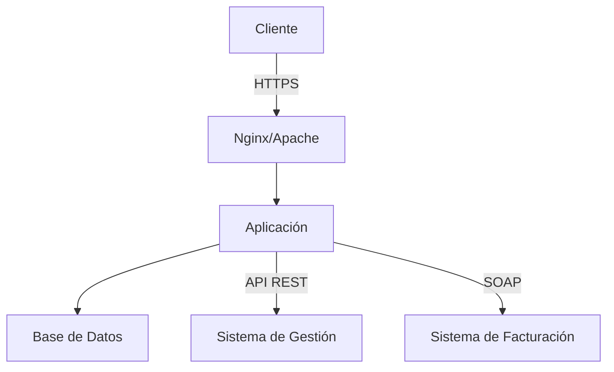

# Análisis del Proyecto de Taller de Integración - Cafetería Automatizada

## Conceptos Principales que se Evalúan

### 1. Integración de Sistemas

- **Sistema de gestión de cafetería (ERP)**
- **Sistema de pedidos**
- **Sistema de facturación**
- Comunicación entre sistemas mediante diferentes protocolos (REST, SOAP)

### 2. Arquitectura y Despliegue

- Configuración de servidores web (Nginx/Apache)
- Implementación de HTTPS con certificados SSL/TLS
- Gestión de bases de datos
- Manejo de ambientes de desarrollo y producción

### 3. Automatización de Procesos

- Gestión de inventario
- Procesamiento de pedidos
- Control de espacios y almacenamiento
- Manejo de vencimientos de productos

## Desglose Técnico del Proyecto

### Infraestructura Base

| Componente       | Especificación                   |
| ---------------- | -------------------------------- |
| SO               | Ubuntu 22.04                     |
| CPU              | 2 núcleos                        |
| RAM              | 2 GB                             |
| Almacenamiento   | 20 GB                            |
| Puertos abiertos | 22 (SSH), 80 (HTTP), 443 (HTTPS) |

### Entregables Principales (Entrega 1)

1. **Servicios REST**

   - Health check endpoint
   - Servicio de recepción de pedidos
   - Integración con sistema de gestión

2. **Sitio Web de Monitoreo**
   - Métricas en tiempo real
   - Visualización de pedidos
   - Dashboard de estado del sistema

### Arquitectura del Sistema

## Recursos y Herramientas Recomendadas

### 1. Servidores Web

- **Nginx** - Recomendado por su rendimiento y simplicidad
- **Apache** - Alternativa robusta y bien documentada
- **Caddy** - Opción moderna con configuración simplificada
- **Traefik** - Ideal para contenedores y microservicios

### 2. Bases de Datos

- **PostgreSQL** - Recomendada para el proyecto
- **MySQL/MariaDB** - Alternativas viables

### 3. Herramientas de Seguridad

- **Let's Encrypt** - Certificados SSL/TLS gratuitos
- **Certbot** - Automatización de certificados
- **OpenSSL** - Herramientas criptográficas

## Mejores Prácticas Recomendadas

### Seguridad

1. **HTTPS**

   - Implementación obligatoria
   - Uso de certificados válidos
   - Renovación automática configurada

2. **Base de Datos**
   - Backups regulares
   - Conexiones seguras
   - Manejo adecuado de credenciales

### Monitoreo

1. **Métricas Críticas**

   - Espacio utilizado por ubicación
   - Stock por SKU
   - Pedidos por hora
   - Productos próximos a vencer

2. **Logging**
   - Registro de transacciones
   - Errores y excepciones
   - Accesos al sistema

## Enlaces y Recursos Adicionales

### Documentación Oficial

- [Nginx Documentation](https://nginx.org/en/docs/)
- [Let's Encrypt Documentation](https://letsencrypt.org/docs/)
- [PostgreSQL Documentation](https://www.postgresql.org/docs/)

### Tutoriales Recomendados

- [Digital Ocean - Nginx Setup](https://www.digitalocean.com/community/tutorials/how-to-install-nginx-on-ubuntu-22-04)
- [Digital Ocean - SSL Configuration](https://www.digitalocean.com/community/tutorials/how-to-secure-nginx-with-let-s-encrypt-on-ubuntu-22-04)
