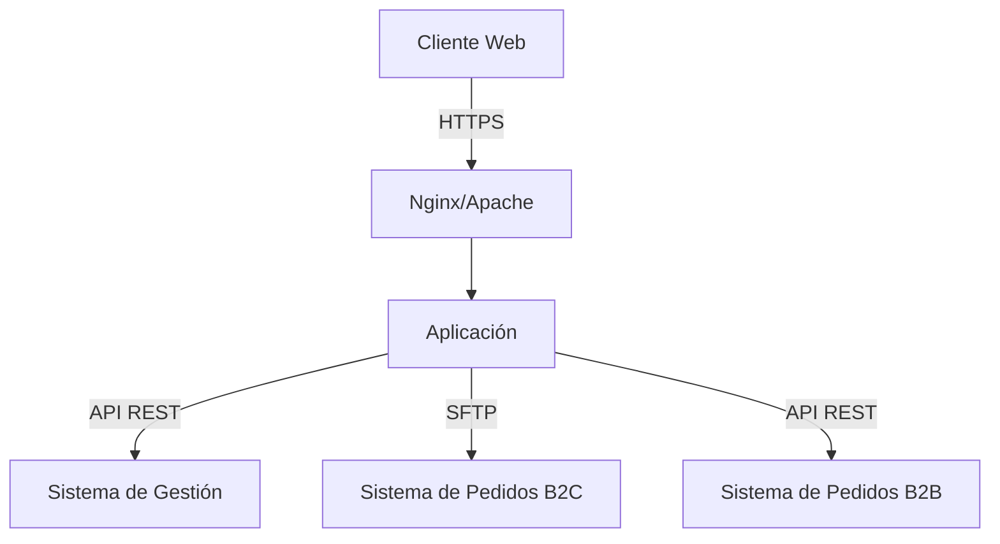

# Análisis de la Entrega 2: Integración de Sistemas de Cafetería

## Resumen Ejecutivo

La Entrega 2 se centra en la implementación de procesos B2B (Business-to-Business) y B2C (Business-to-Consumer) para un sistema de cafetería, con énfasis en la integración de sistemas y la automatización de procesos. El proyecto evalúa conceptos fundamentales de integración de sistemas, manejo de APIs REST, y desarrollo de aplicaciones web robustas.

## Conceptos Clave Evaluados

### 1. Integración de Sistemas

#### Sistemas Principales

- **Sistema de gestión de cafetería (ERP)**:

  - Gestión de inventario
  - Control de espacios
  - Manejo de productos
  - Procesamiento de órdenes

- **Sistema de pedidos**:
  - Manejo de órdenes B2B y B2C
  - Gestión de estados de pedidos
  - Integración con múltiples canales

### 2. Arquitectura de Comunicaciones

| Tipo de Integración | Protocolo | Uso                          |
| ------------------- | --------- | ---------------------------- |
| API REST            | HTTPS     | Sistema de gestión y pedidos |
| SFTP                | SSH       | Recepción de pedidos B2C     |
| Webhooks            | HTTPS     | Notificaciones de pedidos    |

### 3. Patrones de Integración

- **Por Servicios**:

  - APIs REST para comunicación entre sistemas
  - Endpoints específicos para cada operación
  - Manejo de autenticación y autorización

- **Por Datos**:
  - Transferencia de archivos vía SFTP
  - Procesamiento asíncrono de pedidos
  - Persistencia de estados

## Requerimientos Técnicos

### 1. Infraestructura

### 2. Componentes Web Requeridos

- **Frontend**:

  - Interfaz para creación de órdenes
  - Dashboard de estadísticas
  - Visualización de estados de pedidos

- **Backend**:
  - API REST para manejo de pedidos
  - Integración con sistemas externos
  - Procesamiento automático de órdenes

### 3. Métricas de Evaluación

| Criterio                     | Objetivo  |
| ---------------------------- | --------- |
| Órdenes B2B completadas      | ≥ 500     |
| Pedidos B2C procesados       | ≥ 500     |
| Uptime del servidor          | > 90%     |
| Tiempo de operación continua | ~36 horas |

## Recursos y Herramientas Recomendadas

### 1. Servidor Web

- **Nginx**: Recomendado por su performance y simplicidad
- **Apache**: Alternativa robusta y bien documentada
- **Certbot**: Para gestión de certificados SSL/TLS

### 2. Base de Datos

- **PostgreSQL**: Para almacenamiento persistente
- **Redis**: Para caché y manejo de sesiones

### 3. Frameworks de Desarrollo

- **Backend**:
  - Flask/Django (Python)
  - Express (Node.js)
- **Frontend**:
  - React
  - Vue.js

## Mejores Prácticas

1. **Seguridad**:

   - Implementar HTTPS en todos los endpoints
   - Validar inputs y sanitizar datos
   - Manejar errores apropiadamente

2. **Monitoreo**:

   - Implementar health checks
   - Logging de operaciones críticas
   - Métricas de performance

3. **Automatización**:
   - CI/CD para despliegues
   - Tests automatizados
   - Monitoreo automático

## Referencias Adicionales

1. [Digital Ocean - Nginx Setup Guide](https://www.digitalocean.com/community/tutorials/how-to-install-nginx-on-ubuntu-22-04)
2. [Let's Encrypt - SSL/TLS Certificates](https://letsencrypt.org/docs/)
3. [Flask Documentation](https://flask.palletsprojects.com/)
4. [Node.js Production Best Practices](https://expressjs.com/en/advanced/best-practice-performance.html)
