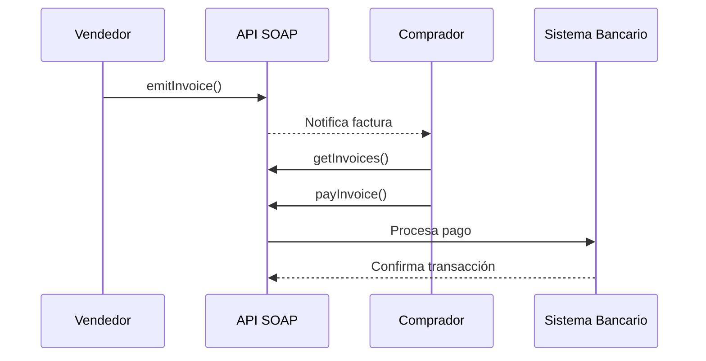

# Análisis y Guía: Entrega 3 - Sistema de Facturación e Integración de Servicios

## 1. Conocimientos Evaluados

Esta entrega se centra en varios conceptos fundamentales de integración de sistemas:

### 1.1 Integración de Servicios

- Implementación de API SOAP para facturación
- Manejo de autenticación básica
- Integración con sistemas existentes (ERP, sistemas de pedidos)
- Gestión de estados y transacciones

### 1.2 Arquitectura del Sistema

- Diseño de sistema distribuido
- Manejo de múltiples canales de venta (B2B, B2C)
- Gestión de inventario y logística
- Procesamiento de pagos y facturación

### 1.3 Infraestructura y Despliegue

- Configuración de servidor web (Nginx/Apache)
- Implementación de HTTPS con certificados SSL/TLS
- Manejo de ambientes (desarrollo/producción)
- Monitoreo de uptime y disponibilidad

## 2. Componentes Principales del Sistema

### 2.1 Sistema de Facturación (SOAP API)

#### Servicios Principales

- `emitInvoice`: Generación de facturas
- `getInvoices`: Consulta de facturas pendientes
- `payInvoice`: Procesamiento de pagos
- `getBankStatement`: Consulta de saldo

#### Flujo de Facturación



### 2.2 Gestión de Inventario y Pedidos

| Espacio            | Función                | Consideraciones                   |
| ------------------ | ---------------------- | --------------------------------- |
| Bodega             | Almacenamiento general | Sin refrigeración                 |
| Bodega refrigerada | Productos perecederos  | Control de temperatura            |
| Bodega externa     | Overflow storage       | Costo adicional $10/hora/producto |
| Cocina             | Preparación            | Tiempo variable por producto      |
| Sector retiro      | Despacho               | Punto de entrega                  |

## 3. Implementación Técnica

### 3.1 Configuración del Servidor

```bash
# Instalación de Nginx
sudo apt update
sudo apt install nginx

# Configuración básica de Nginx
server {
    listen 80;
    server_name tudominio.com;

    location / {
        proxy_pass http://localhost:3000;
        proxy_http_version 1.1;
        proxy_set_header Upgrade $http_upgrade;
        proxy_set_header Connection 'upgrade';
        proxy_set_header Host $host;
        proxy_cache_bypass $http_upgrade;
    }
}
```

### 3.2 Implementación de HTTPS

```bash
# Instalación de Certbot
sudo apt install certbot python3-certbot-nginx

# Obtención de certificado
sudo certbot --nginx -d tudominio.com
```

### 3.3 Cliente SOAP (Python)

```python
from zeep import Client
from zeep.wsse.username import UsernameToken

def setup_soap_client():
    url = 'https://dev.proyecto.2024-2.tallerdeintegracion.cl/soap/billing?wsdl'
    client = Client(
        url,
        wsse=UsernameToken(username, password)
    )
    return client
```

## 4. Objetivos de Negocio y Métricas

### 4.1 Metas de Facturación

- Emisión de 1000+ facturas B2B
- Emisión de 1000+ facturas B2C
- Procesamiento de 1000+ pagos B2B
- Procesamiento de 1000+ pagos B2C

### 4.2 KPIs Operacionales

- Uptime del servidor > 95%
- Saldo positivo en cuenta bancaria
- Tiempo de respuesta del sistema
- Tasa de éxito en procesamiento de pedidos

## 5. Recomendaciones para la Implementación

1. **Arquitectura del Sistema**

   - Implementar patrón Repository para acceso a datos
   - Usar Circuit Breakers para llamadas a servicios externos
   - Implementar rate limiting para APIs

2. **Seguridad**

   - Validar todos los inputs de usuario
   - Implementar logging detallado
   - Mantener secretos en variables de ambiente

3. **Monitoreo**

   - Implementar health checks
   - Configurar alertas de uptime
   - Monitorear uso de recursos

4. **Testing**
   - Pruebas unitarias para lógica de negocio
   - Pruebas de integración para APIs
   - Testing de carga para validar performance

## 6. Recursos Adicionales

- [Documentación oficial de Zeep](https://docs.python-zeep.org/)
- [Guía de implementación SOAP en Node.js](https://www.npmjs.com/package/soap)
- [Best practices para APIs SOAP](https://www.w3.org/TR/soap12-part0/)
- [Tutorial de Nginx](https://www.nginx.com/resources/wiki/start/)
