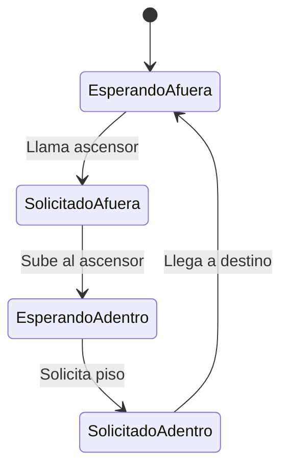

# Tarea 1: Sistema de Ascensores para Hotel Infinito

## Análisis del Enunciado

Esta tarea evalúa varios conceptos fundamentales del desarrollo de APIs RESTful y sistemas distribuidos:

1. **Diseño de APIs REST**

   - Definición clara de endpoints
   - Manejo de estados y recursos
   - Gestión de errores HTTP
   - Documentación de interfaces

2. **Arquitectura de Sistemas**

   - Gestión de estados distribuidos
   - Persistencia de datos
   - Manejo de concurrencia
   - Lógica de negocio compleja

3. **Containerización**
   - Uso de Docker para empaquetado
   - Gestión de imágenes y repositorios
   - Despliegue de aplicaciones

## Conceptos Principales

### APIs RESTful

#### Recursos Principales

- **Elevator**: Gestión de ascensores
- **Level**: Gestión de pisos
- **User**: Gestión de usuarios

#### Operaciones CRUD

| Recurso  | GET | POST | PUT | PATCH | DELETE |
| -------- | --- | ---- | --- | ----- | ------ |
| Elevator | ✓   | ✓    | -   | ✓     | -      |
| Level    | ✓   | -    | -   | -     | -      |
| User     | -   | ✓    | ✓   | -     | ✓      |

### Estados y Transiciones

#### Estados de Usuario

1. Esperando afuera
2. Solicitado afuera
3. Esperando adentro
4. Solicitado adentro



### Lógica de Negocio Crítica

1. **Control de Peso**

   - Verificación de límites
   - Validación antes de entrada
   - Manejo de errores por sobrepeso

2. **Algoritmo de Movimiento**
   - Dirección consistente
   - Optimización de recorrido
   - Priorización de solicitudes

## Herramientas Recomendadas

### Desarrollo

- FastAPI/Flask/Express (APIs REST)
- Redis/MongoDB (Persistencia)
- PostgreSQL (Base de datos)

### Testing

- Postman (Pruebas manuales)
- Docker Test Container
- PyTest/Jest (Unit Testing)

### Despliegue

- Docker
- Docker Hub
- GitHub Actions (CI/CD)

## Consideraciones de Implementación

### Persistencia

```python
class ElevatorState:
    def __init__(self):
        self.elevators = {}
        self.levels = defaultdict(list)
        self.users = {}
```

### Manejo de Errores

```python
@app.exception_handler(HTTPException)
async def custom_exception_handler(request, exc):
    return JSONResponse(
        status_code=exc.status_code,
        content={"error": str(exc.detail)}
    )
```

## Recursos Adicionales

1. **Documentación**

   - [REST API Best Practices](https://restfulapi.net/)
   - [Docker Documentation](https://docs.docker.com/)
   - [FastAPI Tutorial](https://fastapi.tiangolo.com/)

2. **Artículos Relevantes**
   - "Building Scalable RESTful APIs"
   - "State Management in Distributed Systems"
   - "Elevator Algorithm Optimization"

## Requerimientos Técnicos

### Mínimos

- Versionamiento en GitHub
- Persistencia de 10 minutos
- Documentación completa de API

### Entregables

1. Imagen Docker pública
2. Código fuente en GitHub
3. API desplegada y funcional

## Fechas Importantes

- Entrega: 4 de septiembre 2024, 18:00
- Periodo de corrección posterior
