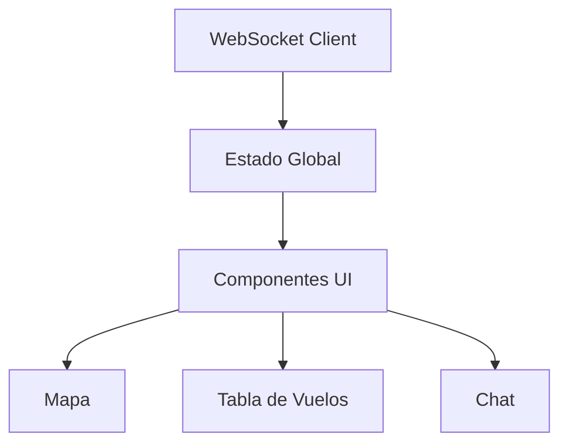

# Análisis de Tarea 2 - Sistema de Seguimiento de Vuelos en Tiempo Real

## Conceptos Principales Evaluados

La tarea evalúa los siguientes conceptos fundamentales:

1. **Comunicación basada en eventos mediante WebSockets**

   - Conexión en tiempo real bidireccional
   - Manejo de eventos asincrónicos
   - Actualización de estado en tiempo real

2. **Visualización de Datos Geoespaciales**

   - Representación de rutas aéreas
   - Tracking de posiciones en tiempo real
   - Marcadores y elementos visuales interactivos

3. **Arquitectura de Frontend Moderna**
   - Frameworks web (React, Vue, Angular)
   - Manejo de estado y actualizaciones en tiempo real
   - Componentes reutilizables

## Desglose Técnico

### 1. WebSocket Communication

#### Eventos del Sistema

| Tipo     | Descripción                | Frecuencia |
| -------- | -------------------------- | ---------- |
| FLIGHTS  | Lista de vuelos activos    | Automática |
| PLANE    | Actualización de posición  | Automática |
| TAKE-OFF | Notificación de despegue   | Por evento |
| LANDING  | Notificación de aterrizaje | Por evento |
| CRASHED  | Notificación de accidente  | Por evento |
| MESSAGE  | Mensajes del chat          | Por evento |

#### Consideraciones Técnicas

- No usar Socket.IO (incompatible con WebSocket puro)
- Mantener conexión persistente
- Manejar reconexiones automáticas

### 2. Visualización del Mapa

#### Elementos Requeridos

```markdown
1. Aeropuertos

   - Marcadores distintivos
   - Información detallada en popup
   - Diferenciación origen/destino

2. Rutas

   - Líneas entre aeropuertos
   - Representación de ruta más corta

3. Aviones
   - Posición en tiempo real
   - Histórico de ruta
   - Estado actual
```

### 3. Interfaz de Usuario

#### Componentes Principales

1. **Mapa Interactivo**

   - Biblioteca recomendada: Leaflet
   - Open Street Map como base

2. **Tabla de Vuelos**

   - Ordenamiento por origen/destino
   - Actualización en tiempo real

3. **Sistema de Chat**
   - Mensajes de usuarios
   - Mensajes de sistema
   - Diferenciación por tipo

## Tecnologías Recomendadas

### Frontend Frameworks

- React (recomendado por componentes reutilizables)
- Vue (buena opción para principiantes)
- Angular (robusto pero mayor curva de aprendizaje)

### Librerías de Mapas

1. **Leaflet**
   - Ventajas:
     - Open source
     - Ligero
     - Amplia documentación
   - Implementación recomendada con React:
     ```javascript
     import { MapContainer, TileLayer, Marker, Popup } from 'react-leaflet';
     ```

### UI Frameworks

- Bootstrap (completo pero pesado)
- Pure CSS (ligero, solo estilos)
- Foundation (alternativa a Bootstrap)

## Recomendaciones de Implementación

### Arquitectura Propuesta



### Manejo de Estado

1. **Datos de Vuelos**

   - Mantener estado centralizado
   - Actualizar por eventos
   - Limpiar datos obsoletos

2. **Posiciones de Aviones**

   - Buffer de posiciones históricas
   - Actualización eficiente
   - Limpieza periódica

3. **Mensajes de Chat**
   - Cola de mensajes
   - Priorización de mensajes importantes
   - Persistencia temporal

## Recursos Adicionales

1. [WebSocket API - MDN Web Docs](https://developer.mozilla.org/en-US/docs/Web/API/WebSocket)
2. [Leaflet Documentation](https://leafletjs.com/reference.html)
3. [React Official Documentation](https://reactjs.org/docs)

## Consideraciones Finales

- Priorizar la experiencia de usuario
- Mantener el código limpio y modular
- Implementar manejo de errores robusto
- Considerar la escalabilidad
- Documentar el código adecuadamente

¿Necesitas que profundice en algún aspecto específico de la implementación?
