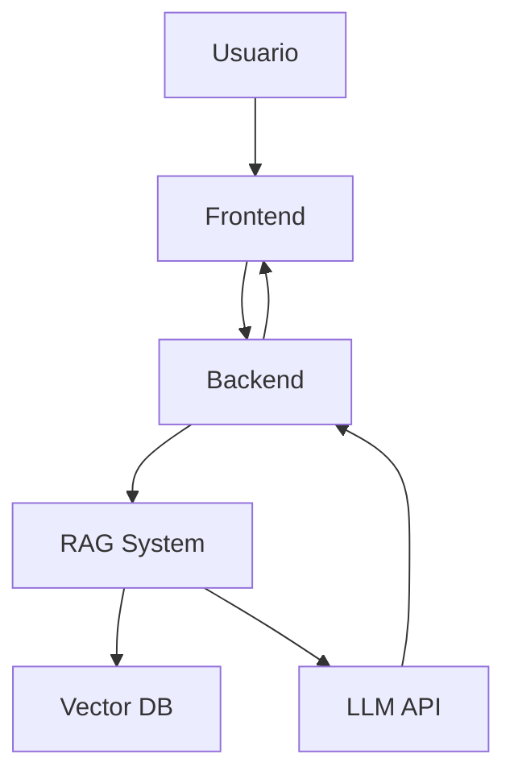

# Chatbot con RAG y LLMs: Guía Técnica Completa

## Conceptos Fundamentales

### Retrieval-Augmented Generation (RAG)

RAG es una técnica que mejora las respuestas de los modelos de lenguaje combinando:

- Recuperación de información relevante de una base de datos
- Generación de respuestas contextualizadas usando LLMs
- Vectorización de texto para búsquedas semánticas

### Large Language Models (LLMs)

- Modelos de IA entrenados para procesar y generar texto
- Capacidad de entender contexto y generar respuestas coherentes
- En este caso: Llama3.2 con 3.21B parámetros

## Arquitectura del Sistema

### Componentes Principales

1. **Sistema de Recopilación de Datos**

   - Web scraping de IMSDB
   - Procesamiento de guiones
   - Almacenamiento estructurado

2. **Pipeline de Procesamiento**

   - Limpieza de texto
   - Segmentación de guiones
   - Generación de embeddings

3. **Base de Datos Vectorial**

   - Almacenamiento de embeddings
   - Búsqueda por similitud
   - Indexación eficiente

4. **API de LLM**
   - Endpoint: tormenta.ing.puc.cl
   - Modelo: integra-LLM
   - Configuraciones específicas:
     - Temperatura: 6
     - Ventana de contexto: 2048 tokens
     - Top-k: 18

### Flujo de Datos



## Implementación Técnica

### Frontend

- Framework recomendado: React.js
- Componentes principales:
  - Chat interface
  - Movie selection
  - Response display
  - Loading states

### Backend

- Framework sugerido: FastAPI/Flask
- Funcionalidades clave:
  - API endpoints
  - RAG integration
  - Error handling
  - Rate limiting

### Vector Database Integration

- Características necesarias:
  - Dimensionalidad: 768 (nomic-embed-text)
  - Búsqueda por similitud
  - Escalabilidad

## Guía de Desarrollo

### 1. Preparación de Datos

```python
def process_script(raw_text):
    # Limpieza básica
    clean_text = remove_html_tags(raw_text)
    clean_text = normalize_whitespace(clean_text)

    # Segmentación
    segments = split_into_chunks(clean_text,
                               chunk_size=1000,
                               overlap=100)
    return segments
```

### 2. Generación de Embeddings

```python
async def generate_embedding(text):
    response = await http_client.post(
        'tormenta.ing.puc.cl/api/embed',
        json={
            'model': 'nomic-embed-text',
            'input': text
        }
    )
    return response.json()['embeddings']
```

### 3. Implementación de RAG

```python
class RAGSystem:
    def retrieve_context(self, query, k=3):
        # Generate query embedding
        query_embedding = generate_embedding(query)

        # Find similar contexts
        similar_contexts = vector_db.search(
            query_embedding,
            limit=k
        )

        return similar_contexts
```

## Mejores Prácticas

### Optimización de Rendimiento

- Caché de embeddings frecuentes
- Batch processing para vectorización
- Índices eficientes en BD vectorial

### Manejo de Errores

- Rate limiting (10 req/seg)
- Timeouts (120 segundos máx)
- Fallbacks para consultas largas

### UX Considerations

- Feedback visual de estados
- Indicadores de procesamiento
- Mensajes de error claros

## Recursos Adicionales

### Documentación Oficial

- [Nomic Embed Text](https://www.nomic.ai/blog/posts/nomic-embed-text-v1)
- [Ollama Documentation](https://ollama.com/library/nomic-embed-text)
- [LangChain Guides](https://python.langchain.com/docs/get_started/introduction)

### Tutoriales y Referencias

- [3Blue1Brown LLM Explanation](https://www.youtube.com/watch?v=wjZofJX0v4M)
- [RAG Implementation Guide](https://www.youtube.com/watch?v=tcqEUSNCn8I)

## Evaluación y Entregables

### Criterios Técnicos

- Funcionalidad completa del chatbot
- Integración correcta de RAG
- Manejo apropiado de errores
- UI/UX intuitiva

### Documentación Requerida

- Código fuente en GitHub
- README detallado
- Guiones procesados
- URL del sitio desplegado
